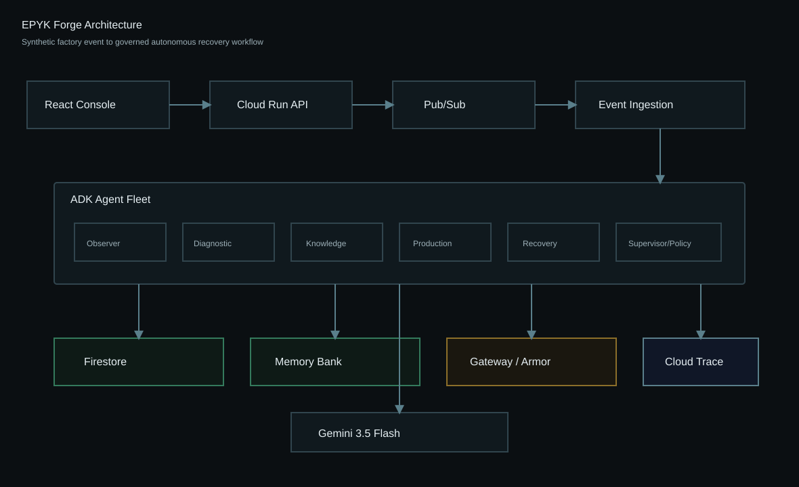

# EPYK Forge

**The autonomous operations fleet for the factory floor.**

EPYK Forge watches synthetic manufacturing operations continuously, detects disruption, coordinates specialized AI agents, and turns incidents into governed recovery workflows before a supervisor opens a chat window.

Northstar Precision Works is fictional and all data is synthetic.



## Hero Workflow

Scenario A, Servo Overload Cascade:

1. MC-04 starts `RUNNING` on `MO-4821`.
2. X-axis servo load rises, cycle time drifts, and short feed holds appear.
3. `AXIS_SERVO_OVERLOAD_X` fires.
4. Observer opens `INC-1042`.
5. Diagnostic, Knowledge, Production, Recovery, and Supervisor agents run.
6. The system creates a maintenance ticket, sets MC-04 to maintenance, creates notifications, and proposes moving 42 remaining parts to MC-02.
7. Schedule application requires supervisor approval.
8. Maintenance resolution writes operational memory.

## Google Technology

- Gemini 3.5 Flash (`gemini-3.5-flash`).
- Google Agent Development Kit (`google-adk`).
- Google Gen AI SDK (`google-genai`) with Gemini Enterprise Agent Platform mode.
- Cloud Run, Pub/Sub, Firestore, Secret Manager, Cloud Logging, Cloud Trace deployment path.
- Agent Runtime deployment script using `vertexai.agent_engines.AdkApp`.

Managed Agent Platform features are not misrepresented. Local mode uses fallback abstractions and `/api/system/info` reports what is actually active.

## Local Setup

```powershell
python -m pip install -e "backend[dev]"
cd frontend
npm.cmd install
```

Backend:

```powershell
$env:FORGE_MODEL_PROVIDER="TEST_STUB"
python -m uvicorn forge.api.main:app --app-dir backend --host 0.0.0.0 --port 8080
```

Frontend:

```powershell
cd frontend
npm.cmd run dev
```

Open `http://localhost:5173`. Local Vite development targets the backend at `http://localhost:8080` when `VITE_FORGE_API_URL` is blank.

## Use The Platform

1. Open the web console.
2. Go to `Admin`.
3. Enter PIN `1234`.
4. Use `Import Complete Seed` to load the full Northstar Precision Works demo dataset.
5. Check `Seeded Machines`, `Seeded Work Orders`, `Seeded Knowledge`, and `Seeded Agents`.
6. Check `Gemini Flash Setup`; when real Gemini env vars are configured, run `Gemini Smoke Test`.
7. Go back to `Overview`, click `Start Scenario`, then open `Incident`.

The Admin panel is the intended setup surface. The Overview page is the operator demo surface.

## Real Gemini Mode

For the actual hackathon demo:

```powershell
$env:FORGE_MODEL_PROVIDER="REAL_GEMINI"
$env:GOOGLE_GENAI_USE_ENTERPRISE="True"
$env:GOOGLE_CLOUD_PROJECT="your-project"
$env:GOOGLE_CLOUD_LOCATION="us-central1"
```

Production mode refuses to run with `TEST_STUB`.

## Cloud Run Deployment

Use the PowerShell deployment path on Windows:

```powershell
gcloud.cmd auth login
gcloud.cmd auth application-default login
$env:GOOGLE_CLOUD_PROJECT="your-project-id"
$env:GOOGLE_CLOUD_LOCATION="us-central1"
.\scripts\bootstrap_gcp.ps1
.\scripts\deploy.ps1
```

If Windows blocks local script execution, use `powershell -NoProfile -ExecutionPolicy Bypass -File scripts\deploy.ps1`.

`forge-web` is built after `forge-api` deploys. The deploy script resolves the real `forge-api` URL and supplies it to Vite as `VITE_FORGE_API_URL` during the frontend image build.

## Demo Commands

```powershell
python scripts/seed_demo.py
python scripts/run_hero_flow.py
```

Or use the UI controls:

- Import Seed
- Enable Seed / Disable Seed
- Reset
- Security Test
- Retry Test
- Start Scenario
- Servo Alarm
- Resolve

Seed data endpoints:

```powershell
Invoke-RestMethod http://localhost:8080/api/demo/seed/status
Invoke-RestMethod http://localhost:8080/api/demo/seed/import -Method Post
Invoke-RestMethod http://localhost:8080/api/demo/seed/disable -Method Post
Invoke-RestMethod http://localhost:8080/api/demo/seed/enable -Method Post
```

## Tests

```powershell
$env:PYTHONPATH="backend"
python -m pytest backend/tests
cd frontend
npm.cmd run typecheck
npm.cmd run test -- --run
npm.cmd run build
cd ..
.\scripts\smoke_cloud.ps1
```

## Deployment

See [docs/DEPLOYMENT.md](docs/DEPLOYMENT.md).

## Documentation

- [Architecture](docs/ARCHITECTURE.md)
- [Security](docs/SECURITY.md)
- [Demo Script](docs/DEMO_SCRIPT.md)
- [Judging Map](docs/JUDGING_MAP.md)
- [Devpost Draft](docs/DEVPOST_SUBMISSION.md)
- [Disclosures](docs/DISCLOSURES.md)
